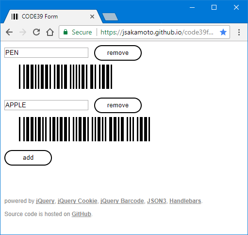

# CODE39 Form

[https://j.mp/code39form](https://j.mp/code39form)

## What's this?

"CODE39 Form" is a HTML application that allows you to generate CODE39 barcode on your web browser screen.

"CODE 39 form" also works with Kindle (1st generation) experiment web browser.

## Features

- Printable (optimized for A4 size)
- Offline work (you should bookmark CODE39 Form site URL.)

## How to build

### Prerequire

- Node.js
- TypeScript v.2.0+
- Gulp CLI

### Initialize

    $ npm install

### Build

    $ gulp build

#### Watch mode

    $ gulp watch

## License

[GNU GPL v3](LICENSE)
